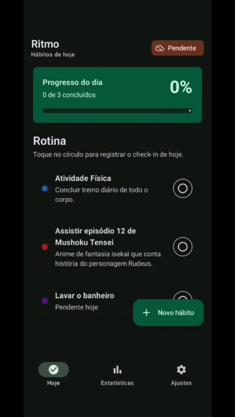
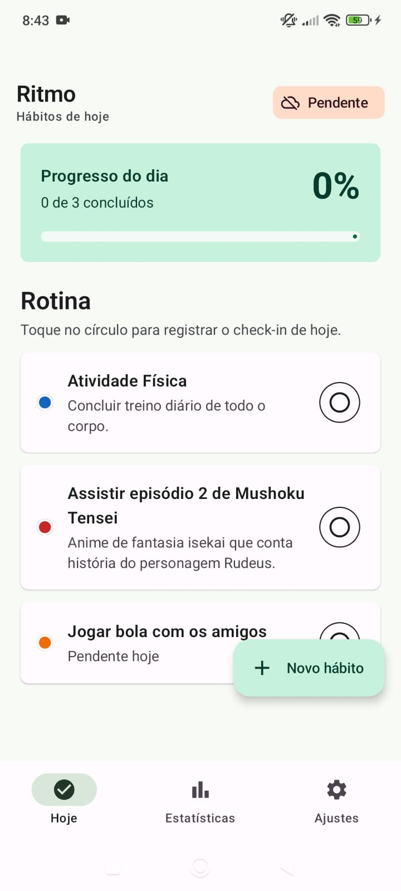
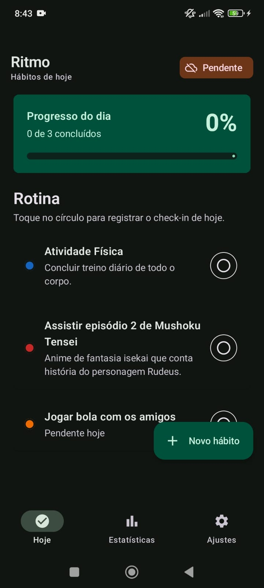
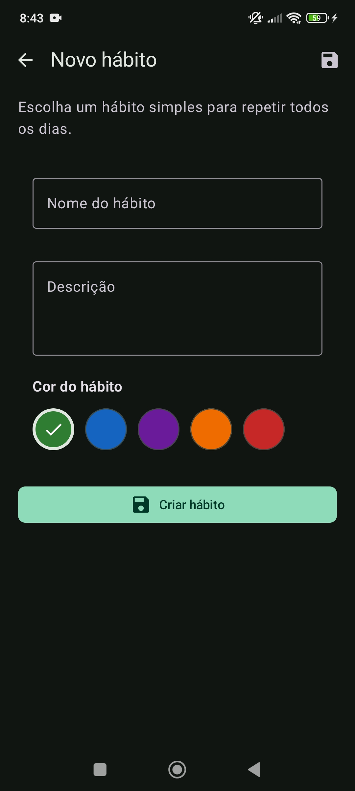
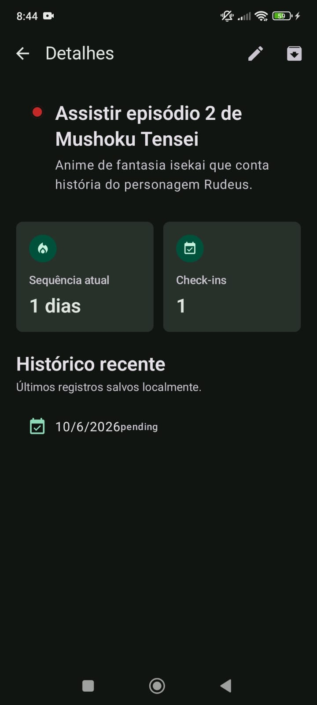
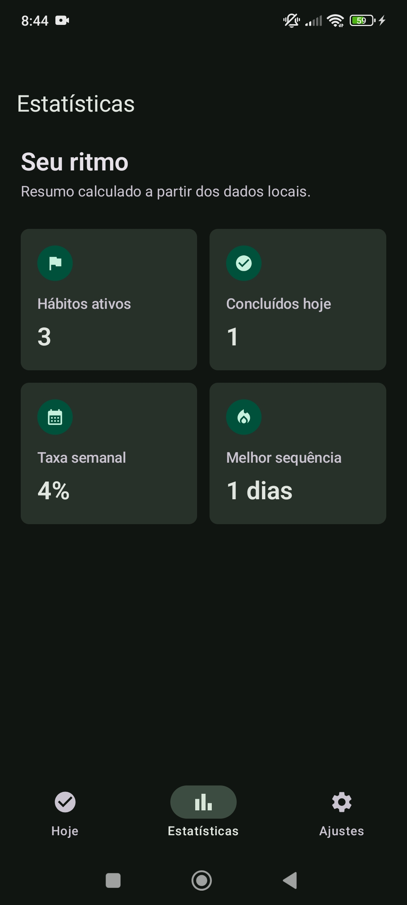
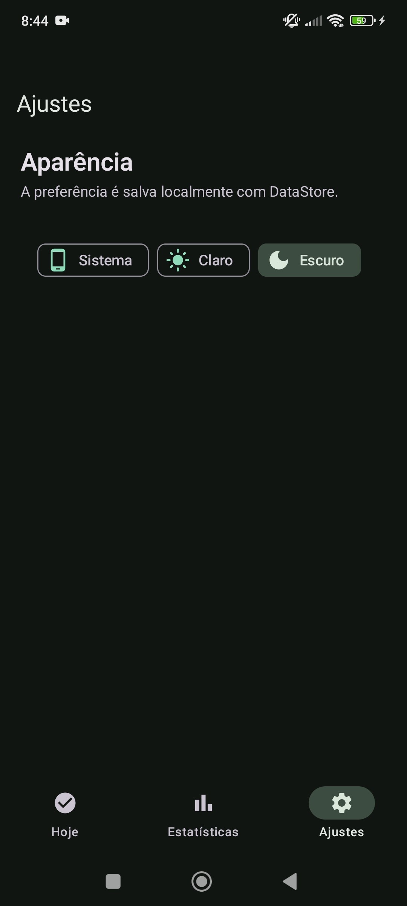

# Ritmo

<div align="center">

<a href="https://kotlinlang.org"></a>
<a href="https://developer.android.com/jetpack/compose"></a>
<a href="https://developer.android.com/training/data-storage/room"></a>
<a href="https://developer.android.com/training/dependency-injection/hilt-android"></a>
<a href="https://developer.android.com/topic/libraries/architecture/workmanager"></a>
<a href="LICENSE"></a>

<br/>
<br/>

**App Android offline-first para acompanhamento de hábitos**  
desenvolvido com Kotlin, Jetpack Compose, Room, DataStore e WorkManager

<br/>
<br/>

<table>
  <tr>
    <td align="center">
      
      <br/>
      <sub>Demo principal do app</sub>
    </td>
  </tr>
</table>

</div>

---

## Funcionalidades

| Categoria | Detalhes |
|----------|----------|
| **Hábitos** | Criar, editar, arquivar e acompanhar hábitos diários |
| **Check-ins** | Marcar e desmarcar a conclusão do dia |
| **Offline-first** | Escritas locais acontecem primeiro usando Room |
| **Sincronização** | Sync fake em background com WorkManager |
| **Preferências** | Tema persistido com DataStore |
| **Estatísticas** | Progresso diário, taxa semanal e sequência |
| **UI** | Jetpack Compose, Material 3 e tema claro/escuro |

---

## Telas Do App

### Hoje

Dashboard principal com progresso diário, cards de hábitos, ação de check-in e status de sincronização.

<table>
  <tr>
    <td align="center">
      
      <br/>
      <sub>Tema claro</sub>
    </td>
    <td align="center">
      
      <br/>
      <sub>Tema escuro</sub>
    </td>
  </tr>
</table>

### Adicionar / Editar Hábito

Formulário para nome, descrição e cor do hábito.

<table>
  <tr>
    <td align="center">
      
      <br/>
      <sub>Adicionar / editar hábito</sub>
    </td>
  </tr>
</table>

### Detalhe Do Hábito

Resumo do hábito com sequência atual, total de check-ins e histórico recente.

<table>
  <tr>
    <td align="center">
      
      <br/>
      <sub>Detalhe do hábito</sub>
    </td>
  </tr>
</table>

### Estatísticas

Resumo de hábitos ativos, hábitos concluídos hoje, taxa semanal de conclusão e melhor sequência.

<table>
  <tr>
    <td align="center">
      
      <br/>
      <sub>Estatísticas</sub>
    </td>
  </tr>
</table>

### Ajustes

Seletor de tema com persistência via DataStore.

<table>
  <tr>
    <td align="center">
      
      <br/>
      <sub>Ajustes</sub>
    </td>
  </tr>
</table>

---

## Stack Técnica

| Categoria | Tecnologias |
|----------|-------------|
| **Linguagem** | Kotlin |
| **UI** | Jetpack Compose, Material 3 |
| **Arquitetura** | ViewModel, StateFlow, Repository |
| **Persistência** | Room, DataStore Preferences |
| **Trabalho em background** | WorkManager |
| **Injeção de dependência** | Hilt |
| **Testes** | JUnit, Coroutines Test, Truth |

---

## Como Rodar

### Pré-requisitos

- JDK 17
- Android SDK
- Dispositivo Android ou emulador

### Configurar o terminal no Windows

```powershell
$env:JAVA_HOME="C:\Program Files\Eclipse Adoptium\jdk-17"
$env:ANDROID_HOME="C:\Android\Sdk"
$env:Path="$env:JAVA_HOME\bin;$env:ANDROID_HOME\cmdline-tools\latest\bin;$env:ANDROID_HOME\platform-tools;$env:Path"
```

### Build

```powershell
.\gradlew.bat :app:assembleDebug
```

### Rodar testes

```powershell
.\gradlew.bat :app:testDebugUnitTest
```

### Instalar no dispositivo

```powershell
adb devices
.\gradlew.bat :app:installDebug
```

---

## Estrutura Do Projeto

```text
ritmo-app/
|-- app/
|   `-- src/main/java/com/ritmo/app/
|       |-- data/          # Modelos de domínio, repository e regras de estatísticas
|       |-- data/local/    # Entidades Room, DAO e banco local
|       |-- data/network/  # Data source remoto fake
|       |-- data/sync/     # Worker de sincronização com WorkManager
|       |-- data/preferences/
|       |-- di/            # Módulos Hilt
|       `-- ui/            # Telas Compose, tema e navegação
|-- .github/workflows/     # Workflow de CI
|-- gradle/                # Version catalog e wrapper
`-- README.md
```

---

## Fluxo Offline-first

```text
Ação do usuário
  -> Atualização no Room
  -> syncState = PENDING
  -> WorkManager agenda sync fake
  -> remoto fake recebe snapshot
  -> syncState = SYNCED
```

---

## Validação

Comandos atuais de verificação:

```powershell
.\gradlew.bat :app:assembleDebug :app:testDebugUnitTest --stacktrace
```

---

## Licença

Apache License 2.0 - veja [LICENSE](LICENSE) para mais detalhes.
